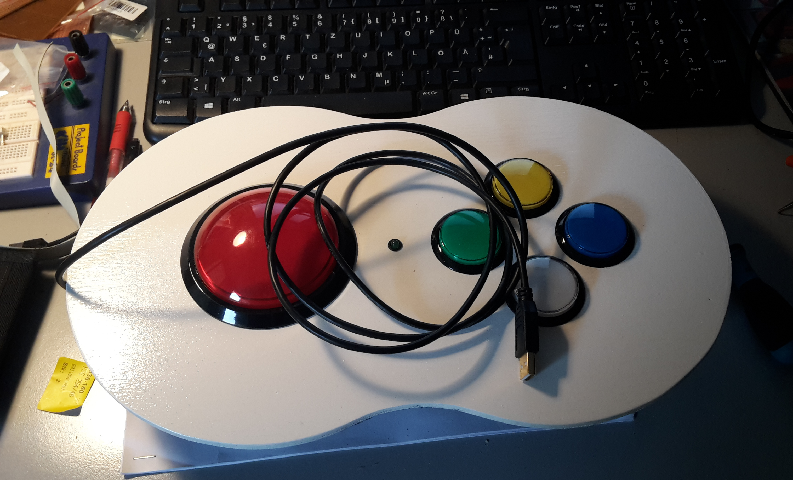
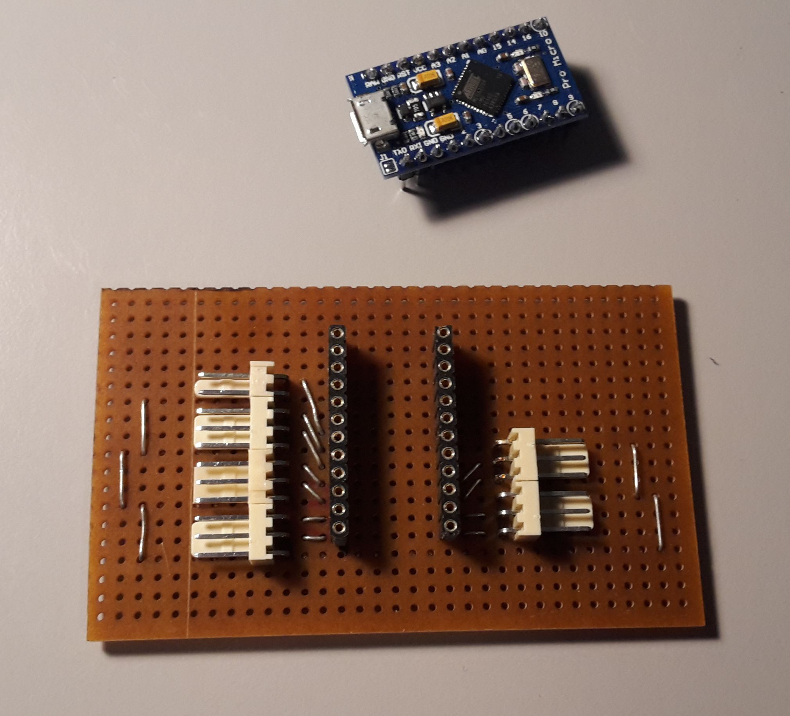

# BuzzerKeyboard
Arduino-based HID (keyboard) with some big buttons to control e.g. web applications.

# Motivation
I was looking for a simple solution to trigger functions of a web application by not using a normal keyboard or mouse.
My main use case is a badminton tournament sióftware (see https://github.com/gromeck/Turnier).

# Requirements
The requirements for the BuzzerKeyboard are as follows:
- The keyboard should be connected via USB to a PC and should be recognized as a standard keyboard by the PC (without any driver or configuration).
- The keyboard should work without any additional power supply beside the USB power.
- The keyboard should be prepared to support up to 5 buttons.
- Each button should send the corresponding keycode whenever the button is pressed. Releasing a button should not send a keycode.

  | Button | Color  | Keycode |
  | :-: | :-: | :-: |
  |   A    | red    | j       |
  |   B    | green  | k       |
  |   C    | yellow | l       |
  |   D    | blue   | m       |
  |   E    | white  | n       |

- Each button should support an LED which is on during the time the button is pressed.
- An activity LED should be on permanently. Whenever a keycode is sent, the activity LED should indicate this by switching off for a short period.
- The buttons of the keyboard are named A, B, C, D and E.
- By pressing the button A for 5 seconds, the configuration mode is enabled.
- The configuration mode is indicated by a blinking activity LED.
- In the configuration mode, the buttons are used as follows:

  | Button | Color  | Function                                   |
  | :-:    | :-:    |--------------------------------------------|
  |   A    | red    | leave the configuration mode               |
  |   B    | green  | set the keycode modifiers to [ALT]         |
  |   C    | yellow | set the keycode modifiers to [ALT]+[SHIFT] |
  |   D    | blue   | set the keycode modifiers to [ALT]+[CTRL]  |
  |   E    | white  | set the keycode modifiers to [NONE]        |

- Whenever an configuration function is changed, the corresponding button should indicate the change by flashing.

# Solution

An Arduino device should be used to implement the requirements.
ATmega32U4 based boards (like Arduino Leonardo, Pro Micro, Due or Zero boards, 3.3V 8 MHz) are able to act like a USB human interface device (HID).

The Arduino makes use of the Keyboard libraries, which let the Arduino act like a keyboard to the connected computer.

As the BuzzerKeybord sends keycodes in combination with a configurable modifier, the web application has only to define access keys.

I used push buttons with microswitches. You will find these by searching vor "arcade push button" in your favorite electronic stores.

# Result

